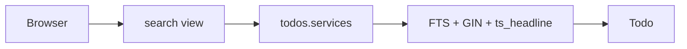
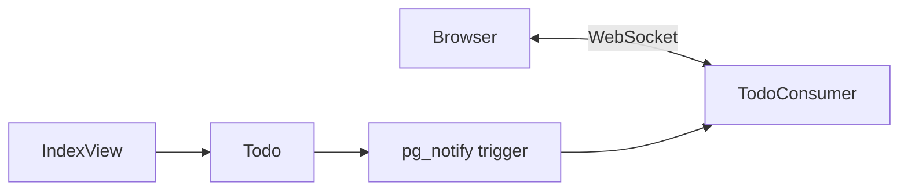
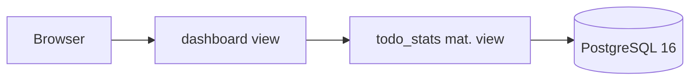
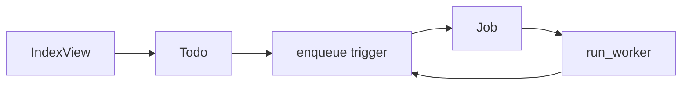
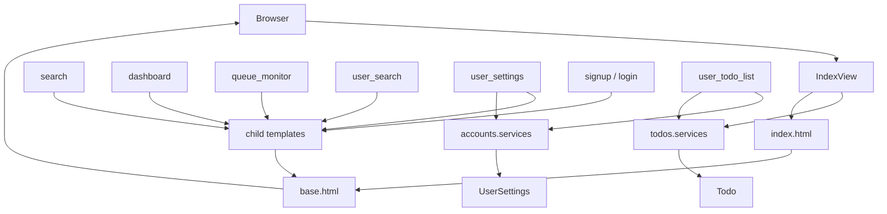
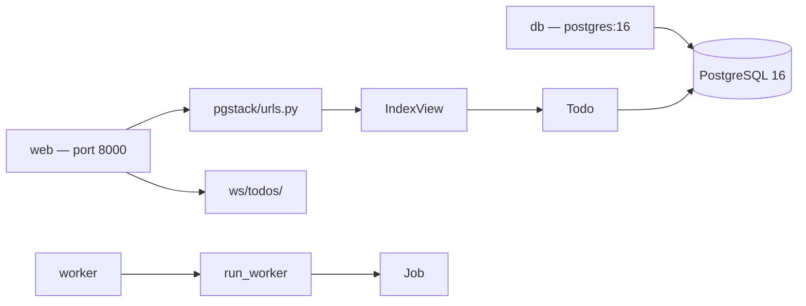

# pgstack — Architecture map

> Reference map of routes, views, services, models, templates, Postgres features, and Docker services.
> Mermaid diagrams below mirror the interactive architecture canvas produced via `/graphify`.

Django MVT on **PostgreSQL 16** — one database replaces Elasticsearch, Redis Pub/Sub, Redis cache, and SQS/Celery.

---

## Layers

| Layer | What it holds |
| ----- | ------------- |
| Client | Browser HTML + WebSocket client |
| Routes | URLconf and WebSocket routing |
| Views | Thin Django views and Channels consumers |
| Templates | Django templates (all extend `base.html`) |
| Services | Business logic (`services.py`, `worker.py`) |
| Models | Django ORM models |
| Postgres | DB triggers, FTS, NOTIFY, mat view, SKIP LOCKED |
| Infrastructure | Docker Compose services |

---

## Postgres replacements

| Replaces | Postgres feature | Primary code |
| -------- | ---------------- | ------------ |
| Elasticsearch | `tsvector` + GIN + `ts_headline` + pg_trgm | `todos/services.py` (`search_todos`), migrations `0003`–`0005` |
| Redis Pub/Sub | `pg_notify` + `LISTEN` | `todos/consumers.py`, migration `0006` |
| Redis cache | `todo_stats` materialized view + concurrent refresh | `todos/services.py` (`fetch_todo_stats_for_owner`), migrations `0009`–`0011` |
| SQS / job queue | `SELECT FOR UPDATE SKIP LOCKED` + enqueue trigger | `todos/worker.py`, migration `0012` |

---

## Full architecture

```mermaid
flowchart TB
  subgraph client [Client]
    browser[Browser]
  end

  subgraph routes [Routes]
    urls[pgstack/urls.py]
    todos_urls[todos/urls.py]
    accounts_urls[accounts/urls.py]
    ws_route[ws/todos/]
  end

  subgraph views [Views]
    index_view[IndexView]
    search_view[search]
    dashboard_view[dashboard]
    queue_view[queue_monitor]
    user_search_view[user_search]
    user_todos_view[user_todo_list]
    settings_view[user_settings]
    auth_views[signup / login / logout]
    consumer[TodoConsumer]
  end

  subgraph services [Services]
    todos_svc[todos.services]
    accounts_svc[accounts.services]
    worker[run_worker]
  end

  subgraph models [Models]
    todo_model[Todo]
    job_model[Job]
    settings_model[UserSettings]
  end

  subgraph postgres [Postgres]
    pg_fts[FTS + GIN + ts_headline]
    pg_notify[pg_notify + LISTEN]
    pg_matview[todo_stats mat. view]
    pg_skiplocked[SKIP LOCKED queue]
    postgres[(PostgreSQL 16)]
  end

  subgraph infra [Infrastructure]
    docker_web[web — Daphne ASGI]
    docker_worker[worker]
    docker_db[db]
  end

  browser --> urls
  browser --> ws_route
  urls --> todos_urls
  urls --> accounts_urls
  urls --> auth_views
  todos_urls --> index_view
  todos_urls --> search_view
  todos_urls --> dashboard_view
  todos_urls --> queue_view
  accounts_urls --> user_search_view
  accounts_urls --> user_todos_view
  accounts_urls --> settings_view
  ws_route --> consumer

  index_view --> todos_svc
  search_view --> todos_svc
  dashboard_view --> todos_svc
  queue_view --> todos_svc
  user_todos_view --> todos_svc
  user_search_view --> accounts_svc
  user_todos_view --> accounts_svc
  settings_view --> accounts_svc
  auth_views --> accounts_svc

  todos_svc --> todo_model
  todos_svc --> job_model
  accounts_svc --> settings_model

  todo_model --> pg_fts
  todo_model --> pg_notify
  todo_model --> pg_matview
  todo_model --> pg_skiplocked
  job_model --> pg_skiplocked
  consumer --> pg_notify
  worker --> pg_skiplocked

  pg_fts --> postgres
  pg_notify --> postgres
  pg_matview --> postgres
  pg_skiplocked --> postgres

  docker_web --> urls
  docker_web --> ws_route
  docker_worker --> worker
  docker_db --> postgres
```

---

## Postgres feature paths

### Search (replaces Elasticsearch)



### Live updates (replaces Redis Pub/Sub)



### Dashboard (replaces Redis cache)



### Job queue (replaces SQS / Celery)



---

## MVT request flow

Views delegate to services; templates extend `base.html` and render back to the browser.



### Templates

| Template | Path | Extends |
| -------- | ---- | ------- |
| Base layout + nav | `todos/templates/todos/base.html` | — |
| Todo list + WebSocket | `todos/templates/todos/index.html` | `base.html` |
| FTS results | `todos/templates/todos/search_results.html` | `base.html` |
| Mat-view counts | `todos/templates/todos/dashboard.html` | `base.html` |
| Job queue monitor | `todos/templates/todos/queue_monitor.html` | `base.html` |
| Sign up | `accounts/templates/accounts/signup.html` | `base.html` |
| Log in | `accounts/templates/registration/login.html` | `base.html` |
| Find users | `accounts/templates/accounts/user_search.html` | `base.html` |
| Privacy settings | `accounts/templates/accounts/user_settings.html` | `base.html` |
| Public todo list | `accounts/templates/accounts/user_todo_list.html` | `base.html` |

Nav in `base.html`: **Todos | Search | Users | Dashboard | Queue | Settings** plus Log in / Register / Log out.

---

## Docker stack



| Service | Command / role | File |
| ------- | -------------- | ---- |
| `db` | PostgreSQL 16, healthcheck, persistent volume | `docker-compose.yml` |
| `web` | Daphne ASGI — Django + Channels | `docker-compose.yml` |
| `worker` | `wait_for_db` → `run_worker` | `docker-compose.yml`, `todos/management/commands/run_worker.py` |

---

## HTTP routes

### Root (`pgstack/urls.py`)

| Path | Name | Handler |
| ---- | ---- | ------- |
| `/admin/` | — | Django admin |
| `/auth/signup/` | `signup` | `accounts.views.signup` |
| `/auth/logout/` | `logout` | `accounts.views.logout` |
| `/auth/login/` | `login` | Django auth views |
| *(includes)* | — | `accounts.urls`, `todos.urls` |

### Todos (`todos/urls.py`)

| Path | Name | View | Auth |
| ---- | ---- | ---- | ---- |
| `/` | `index` | `IndexView` | POST requires login |
| `/search/` | `search` | `search` | Scoped to viewer |
| `/dashboard/` | `dashboard` | `dashboard` | Login required |
| `/queue/` | `queue_monitor` | `queue_monitor` | Login required |

### Accounts (`accounts/urls.py`)

| Path | Name | View | Auth |
| ---- | ---- | ---- | ---- |
| `/users/search/` | `user_search` | `user_search` | Login required |
| `/users/<username>/todos/` | `user_todos` | `user_todo_list` | Login required; privacy check |
| `/settings/` | `settings` | `user_settings` | Login required |

### WebSocket (`todos/routing.py`)

| Path | Consumer | Auth |
| ---- | -------- | ---- |
| `/ws/todos/` | `TodoConsumer` | Authenticated only |

---

## Node catalog

Quick lookup from graph node → source file → responsibility.

| Node | Layer | File | Detail |
| ---- | ----- | ---- | ------ |
| Browser | Client | — | HTML pages + WebSocket client on `index.html` |
| `pgstack/urls.py` | Route | `pgstack/urls.py` | Root URLconf: admin, auth, includes |
| `todos/urls.py` | Route | `todos/urls.py` | `/`, `/search/`, `/dashboard/`, `/queue/` |
| `accounts/urls.py` | Route | `accounts/urls.py` | `/users/…`, `/settings/` |
| `ws/todos/` | Route | `todos/routing.py` | WebSocket route → `TodoConsumer` |
| `IndexView` | View | `todos/views.py` | GET list; POST create when authenticated |
| `search` | View | `todos/views.py` | FTS + trigram ranked search |
| `dashboard` | View | `todos/views.py` | Reads `todo_stats` materialized view |
| `queue_monitor` | View | `todos/views.py` | Latest 50 jobs for viewer's todos |
| `user_search` | View | `accounts/views.py` | Find users by username |
| `user_todo_list` | View | `accounts/views.py` | Public or own list + scoped search |
| `user_settings` | View | `accounts/views.py` | Toggle `is_todo_list_private` |
| signup / login / logout | View | `accounts/views.py` | Auth flows |
| `TodoConsumer` | View | `todos/consumers.py` | asyncpg `LISTEN todo_updates` |
| `base.html` | Template | `todos/templates/todos/base.html` | Shared nav + auth links |
| `index.html` | Template | `todos/templates/todos/index.html` | List, create form, WebSocket script |
| `todos.services` | Service | `todos/services.py` | CRUD, search, dashboard counts, jobs |
| `accounts.services` | Service | `accounts/services.py` | Register, privacy, user search |
| `run_worker` | Service | `todos/worker.py` | SKIP LOCKED poll loop |
| `Todo` | Model | `todos/models.py` | Owner FK, FTS fields, status |
| `Job` | Model | `todos/models.py` | Queue row linked to todo |
| `UserSettings` | Model | `accounts/models.py` | OneToOne user; private-by-default |
| FTS + GIN + ts_headline | Postgres | migrations `0003`–`0005` | Replaces Elasticsearch |
| pg_notify + LISTEN | Postgres | migration `0006`, `0008` | Replaces Redis Pub/Sub |
| todo_stats mat. view | Postgres | migrations `0009`–`0011` | Replaces Redis cache |
| SKIP LOCKED queue | Postgres | migration `0012` | Replaces SQS / Celery |
| PostgreSQL 16 | Postgres | — | Single DB for all features |
| web | Infra | `docker-compose.yml` | Daphne ASGI on port 8000 |
| worker | Infra | `docker-compose.yml` | Background job processor |
| db | Infra | `docker-compose.yml` | postgres:16 with healthcheck |

---

## Related docs

- [`PROJECT_GUIDELINES.MD`](PROJECT_GUIDELINES.MD) — coding patterns and directory layout
- [`PROJECT_PLAN.MD`](PROJECT_PLAN.MD) — phased build plan and demo script
- [`TASK_CHECKLIST.MD`](TASK_CHECKLIST.MD) — PR-by-PR completion checklist
